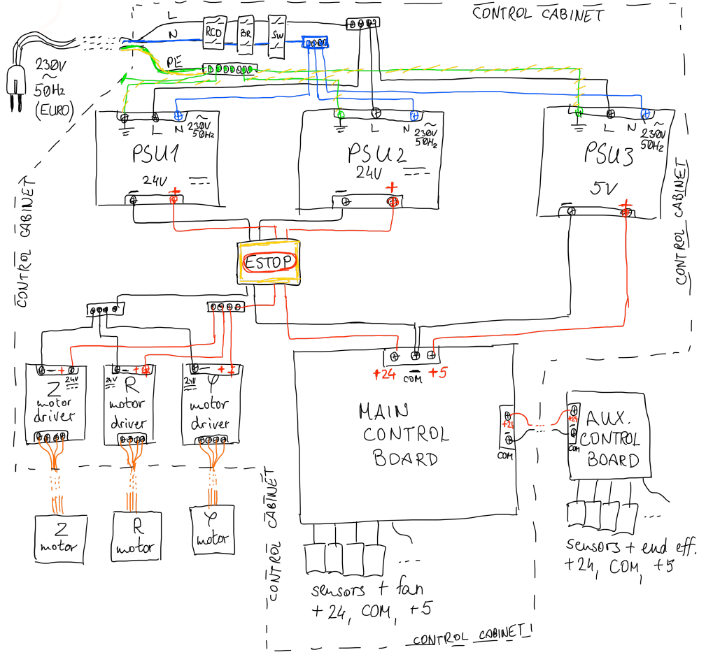
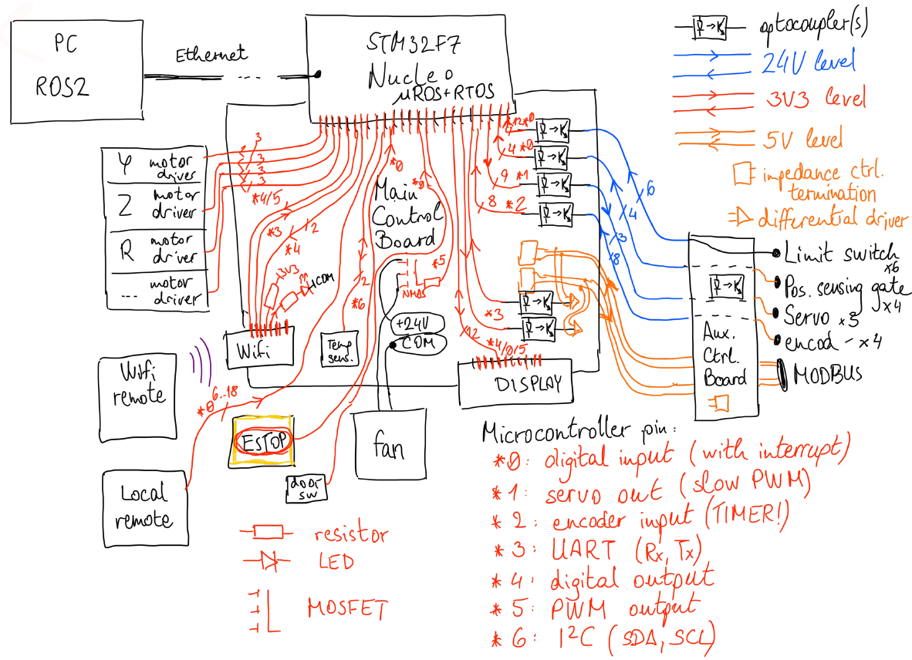

% Industrial robot arm hardware documentation
***

This document describes the hardware aspect (mechanical construction, power distribution and control circuitry) of the industrial robot arm (nicknamed "Karcsi") made by the INDACT project of LEGO Kör.

# Mechanical construction

> TODO complete this section with mCAD models and diagrams

The robot arm is constructed from extruded aluminium bars, machined stainless steel plates, aluminium spacer rods, and held together with screws. A vertical profile and a paralel ball screw are mounted on a rotary base, forming the Z axis of the arm's movement. A carriage riding on this profile is connected to another, horizontal profile, which forms the R axis. The end-effector, currently a 3D-printed mechanical hand with 5 fingers, is attached to one end of the R axis profile.

The base enables rotary movement (Phi axis), realised by a stepper motor and belt-drive. The Z axis movement is realised by a stepper motor, mounted at the upper end of the Z axis profile, driving the ball screw. The R axis movement is realised by a stepper motor mounted on the carriage, driving a studded belt fastened to the R axis profile, similarly to how cheap laser-engravers move. The movement of the fingers is realised by 3 servos inside the palm section of the hand assembly.

We plan to extend the arm's movement capabilities by introducing up to 3 more degrees of freedom through a wrist assembly that would enable tilting and rotation (Theta axis) of the end-effector.

# Power distribution

The arm is powered from the European power grid (single-phase 230V 50Hz) through the control cabinet. This cabinet is equipped with a RCD, circuit breaker, mains switch, and 3 separate, galvanically isolated switch-mode AC-to-DC power supplies:

* PSU1 supplies +24V DC to the stepper motor drivers, is sized to continuously withstand the high currents the motors draw, and wired directly to the motor drivers in the control cabinet.

* PSU2 supplies +24V DC to the control electronics, for long distance signal wiring, powering a cooling fan, and optical isolation. This 24V power line is routed through the main control board and auxiliary control board. The auxiliary control board creates its own 5V power with a switch-mode 24VDC-to-5VDC Buck converter.

* PSU3 supplies +5V DC to the control electronics, to power digital control and measurement circuitry. This 5V power line is routed through the main control board. The main control board creates 3.3V for logic-level circuitry with a 5V-to-3V3 Low-Dropout linear regulator (LDO).

The Emergency Stop (ESTOP) button breaks both 24V lines, but not 5V, so the ESTOP event can be logged by the control logic.

The diagram below shows how power is distributed.

# Control and data flow

The arm is controlled and programmed through ROS, the Robot Operating System, running on a PC, connected to the arm by an Ethernet link. Low-level control is performed by an STM32F7 microcontroller, residing on a Nucle-F7 development board conencted to the main control board by pinheaders. The specific microcontroller and development board were chosen due to ROS and Ethernet support, and part availability considerations. The Nucleo has the Ethernet interface built-in.

Additionally, direct movement control is possible via a remote, connected over Wifi to the arm. The Wifi module is connected to the microcontroller via an UART link and additional control signals (CH-PD, Reset, and 2 GPIO pins, one pulled up and one driving a Wifi indicator LED), and receives 3.3V power from the main control board.

Direct movement control is also possible through a locally connected interface (one pushbutton for each direction of each axis, 6 to 18 in total) located inside the control cabinet, for testing and debugging purposes, and as backup in case ROS and Wifi both fail.

The arm is equipped with limit switches on all axes, and additional position sensing gates on the Z and R axes. The stepper motors for the R, Z, Phi and Theta axes are equipped with rotary encoders to provide feedback about their movement. A temperature sensor measures the internal temperature of the control cabinet. A microswitch or hall-effect sensor detects whether the control cabinet is open.

The stepper motors of the axes are controlled via motor drivers, located in the control cabinet. The microcontroller controls the motor drivers through 3 wires each: PUL, DIR, ENA (COM is passed along as a 4th reference wire). The motors perform one step for each pulse on PUL, in the direction specified via DIR, if ENA is pulled high.

The servos in the end-effector communicate with the microcontroller directly over 3-wire interfaces. The control cabinet cooling fan is PWM controlled by the microcontroller, driven by a MOSFET.

The Emergency Stop (ESTOP) industrial emergency stop button (push to engage, turn to reset) breaks both 24V power lines, but 5V power remains online, and an ESTOP signal is sent to the microcontroller (one pin is pulled low), so the system can log ESTOP events.

The microcontroller displays status messages, error codes and other information on a 2-by-15 character LCD display visible from outside the control cabinet through a window. The display uses a 11-wire interface (including 3.3V power and COM) to communicate with the microcontroller.

For intercompatibility with other end-effectors in the future, a MODBUS (TIA/EIA-485) link is provided from the microcontroller to the auxiliary control board. The MODBUS link is a duplex differential link, optically isolated and terminated on both ends, using 5V line levels.

An additional SPI 4-wire interface is present on the Main Control Board for future expansion.

The Nucleo, display, temperature sensor, cooling fan, motor drivers, Wifi module, Main Control Board, and all power supplies and mains-voltage devices are located in the control cabinet. The stepper motors are connected directly to the motor drivers. The limit switches, position sensing gates, encoders, end-effector servos, and the MODBUS interface are wired through the Auxiliary Control Board, located on the R axis profile near the end-effector. The driver cables for the Z and R axis motors (as well as the planned wrist rotation and tilt motors), 24V power, the MODBUS (TIA/EIA-485) impedance-controlled differential trunk cable, the end-effector servo wires, and the wires for the encoders, limit switches and position sensing gates, together form the Spinal Cable of the arm, encased in plastic wire-guarding worms along the Z and R axes.

The connections for the limit switches, encoders, servos and position sensing gates are all optically isolated on both ends, and use 24V signa-levels to reduce attenuation over longer distances. The optocouplers and 24V drivers are located on the Main Control Board and Auxiliary Control Board.

The diagram below shows how control signals and peripherals are connected.

Microcontroller connection list:

| Peripheral | Type of connection | Optical isolation | Number of connections |
| :--------: | :----------------: | :---------------: | :-------------------- |
| Limit switch | digital input | yes | 6 (R, Z, Phi axes, 2 each) |
| Position sensing gate | digital input | yes | 4 (R, Z axes, 2 each) |
| Encoder | 32-bit timer digital input | yes | 8 (R, Z, Phi, Theta axes, 2 wires each)[^1] |
| Temperature sensor | I2C | no | 2 (SDA, SCL) |
| ESTOP button | digital input | no | 1 |
| Door switch | digital input | no | 1 |
| Debugging movement buttons | digital input | no | 6...18 (all axes and servos, 2 each) |
| Cooling fan | PWM output | no | 1 |
| Stepper motor driver | digital and PWM output | no | 12 (R, Z, Phi, Theta axes, 3 wires each) |
| Servo | PWM output | yes | 3 (3 servos, 1 wire each) |
| Display | paralel digital input-output and PWM putput | no | 11+1 (paralel IO + backlight) |
| Wifi module | UART and digital output | no | 4 (Rx, Tx, CH-PD, Reset) |
| MODBUS link | UART | yes | 2 (Rx, Tx) |
| SPI expansion | SPI | no | 4 (SCL, MISO, MOSI, NSS) |
| Nucleo Ethernet | built-in | no | built-in |
| Nucleo Reset and other buttons | built-in | no | built-in |
| Nucleo USB-OTG | built-in | no | built-in |
| Nucleo LEDs | built-in | no | built-in |

[^1]: The Phi axis encoder is not wired through the Aux. Control Board.

Filtering and decoupling capacitors, oscillators, etc. are built into the Nucleo board for the STM32. An RC Reset circuit, power decoupling capacitor, a pull-up resistor on GPIO0, and a status LED with series resistor on GPIO2 are required for the Wifi module. Decoupling capacitor is recommended for the display, as well as the temperature sensor. For all digital inputs, internal pullup is required (configurable in STM32 CubeIDE). The N-channel MOSFET driving the cooling fan requires a Gate resistor to prevent it from overloading the STM32 GPIO pins while switching. The MODBUS connection requires termination on both ends, pull-up and pull-down resistors on the Main Control Board, and differential, isolated line-drivers and receivers for both connections. The display needs a trimmer potetntiometer with the ends between 5V and COM and the wiper conneted to pin 3 to set the contrast, as well as a MOSFET (and accompanying Gate resistor) and series resistor to drive its backlight LED.

Optocouplers referred to as Output Optocouplers are driven by 3.3V logic-level GPIO pins, have to withstand 24V on their outputs, and have to reliably switch at several hundred kHz of frequency.
Optocouplers referred to as Input Optocouplers have to withstand being driven by 24V signals, provide 3.3V logic-level outputs, and have to reliably switch at several hundred kHz of frequency.

Servo outputs require Output Optocouplers on the Main Control Board, and Input Optocouplers on the Aux. Control Board.
Limit switches, position sensing gates and encoders require Input Optocouplers on the Main Control Board, and Output Optocouplers on the Aux. Control Board. For the encoders, high-speed optos are required.
Optically isolating the MODBUS link is optional.

Both the Main Control Board and Aux. Control Board have LEDs to indicate power-on state.

For connections between the Main Control Board, Aux. Control Board, and other parts, the Molex ... connector is used.

# Microcontroller pinout and configuration

The table below contains pinout information for the STM32F7 Nucleo board.

| Pin | Function | Notes |
| --: | :------- | :---- |
| PA0 | TIM2_CH1 | End-effector Servo 1 PWM control |
| PA1 | RMII_Ref_CLK | Ethernet (built-in) |
| PA2 | RMII_MDIO | Ethernet (built-in) |
| PA3 | TIM2_CH4 | End-effector Servo 2 PWM control |
| PA4 | SPI3_NSS | Expansion SPI Slave-Select |
| PA5 | GPIO_IN | Phi axis Pushbutton for Counterclockwise movement |
| PA6 | TIM3_CH1 | Z axis Encoder A |
| PA7 | RMII_CRS | Ethernet (built-in) |
| PA8 | USB_SOF | USB (built-in) |
| PA9 | USB_VBUS | USB (built-in) |
| PA10 | USB_ID | USB (built-in) |
| PA11 | USB_DM | USB (built-in) |
| PA12 | UDB_DP | USB (built-in) |
| PA13 | SWD_TMS | Serial Wire Debug programming (built-in) |
| PA14 | SWD_TCK | Serial Wire Debug programming (built-in) |
| PA15 | GPIO_IN | Phi axis Pushbutton for Clockwise movement |
| PB0 | LED1 | Green LED (built-in) |
| PB1 | GPIO_IN | Z axis Pushbutton for Up movement |
| PB2 | SPI3_MOSI | Expansion SPI MOSI (DO) |
| PB3 | SW0 | programming switch (built-in) |
| PB4 | GPIO_OUT | Phi axis stepper motor driver Direction |
| PB5 | TIM3_CH2 | Z axis Encoder B |
| PB6 | GPIO_OUT | Phi axis stepper motor driver Enable |
| PB7 | LED2 | Blue LED (built-in) |
| PB8 | TIM10_CH1 | Phi axis stepper motor driver Step PWM control |
| PB9 | TIM11_CH1 | Theta axis stepper motor driver Step PWM control |
| PB10 | TIM2_CH3 | End-effector Servo 3 PWM control |
| PB11 | GPIO_IN | Z axis Pushbutton for Down movement |
| PB12 | GPIO_IN | R axis Pushbutton for Outward movement |
| PB13 | RMII_TXD1 | Ethernet (built-in) |
| PB14 | LED3 | Red LED (built-in) |
| PB15 | GPIO_IN | R axis Pushbutton for Inward movement |
| PC0 |  |  |
| PC1 | RMII_MDC | Ethernet (built-in) |
| PC2 | GPIO_IN | Theta axis Pushbutton for Counterclockwise movement |
| PC3 | GPIO_IN | Theta axis Pushbutton for Clockwise movement |
| PC4 | RMII_RXD0 | Ethernet (built-in) |
| PC5 | RMII_RXD1 | Ethernet (built-in) |
| PC6 | TIM8_CH1 | Theta axis Encoder A |
| PC7 | TIM8_CH2 | Theta axis Encoder B |
| PC8 | GPIO_IN | End-effector Servo 1 Pushbutton for curl finger movement |
| PC9 | GPIO_IN | End-effector Servo 1 Pushbutton for straighten finger movement |
| PC10 | SPI3_CLK | Expansion SPI clock |
| PC11 | SPI3_MISO | Expansion SPI MISO (DI) |
| PC12 | UART5_TX | MODBUS transmit |
| PC13 | USER_BTN | Pushbutton (built-in) |
| PC14 | RCC_OSC32_IN | 32 MHz oscillator (built-in) |
| PC15 | RCC_OSC32_OUT | 32 MHz oscillator (built-in) |
| PD0 | GPIO_IN | Phi axis Limit switch 1 |
| PD1 | GPIO_IN | Phi axis Limit switch 2 |
| PD2 | UART5_RX | MODBUS receive |
| PD3 | GPIO_IN | Z axis limit switch 1 |
| PD4 | GPIO_IN | Z axis limit switch 2 |
| PD5 | GPIO_IN | R axis Limit switch 1 |
| PD6 | GPIO_IN | R axis Limit switch 2 |
| PD7 |  |  |
| PD8 | STLK_RX | ST-link (built-in) |
| PD9 | STLK_TX | ST-link (built-in) |
| PD10 | GPIO_IN | End-effector Servo 2 Pushbutton for curl finger movement |
| PD11 | GPIO_IN | End-effector Servo 2 Pushbutton for straighten finger movement |
| PD12 | TIM4_CH1 | R axis Encoder A |
| PD13 | TIM4_CH2 | R axis Encoder B |
| PD14 | GPIO_IN | End-effector Servo 3 Pushbutton for curl finger movement |
| PD15 | GPIO_IN | End-effector Servo 3 Pushbutton for straighten finger movement |
| PE0 | UART8_RX | Wifi module serial receive |
| PE1 | UART8_TX | Wifi module serial transmit |
| PE2 | GPIO_OUT | Wifi module CH_PD |
| PE3 | GPIO_OUT | Wifi module Reset |
| PE4 |  |  |
| PE5 | TIM9_CH1 | Z axis stepper motor driver Step PWM control |
| PE6 | TIM9_CH2 | R axis stepper motor driver Step PWM control |
| PE7 | GPIO_OUT | Z axis stepper motor driver Direction |
| PE8 | GPIO_OUT | Z axis stepper motor driver Enable |
| PE9 | TIM1_CH1 | Phi axis Encoder A |
| PE10 | GPIO_OUT | R axis stepper motor driver Direction |
| PE11 | TIM1_CH2 | Phi axis Encoder B |
| PE12 | GPIO_OUT | R axis stepper motor driver Enable |
| PE13 | TIM1_CH3 | Cooling fan PWM control |
| PE14 | TIM1_CH4 | LCD backlight PWM control |
| PE15 |  |  |
| PF0 | I2C2_SDA | Temperature sensor data |
| PF1 | I2C2_SCL | Temperature sensor clock |
| PF2 |  |  |
| PF3 |  |  |
| PF4 |  |  |
| PF5 | GPIO_OUT | LCD Data (H) / Command (L) |
| PF6 | GPIO_OUT | LCD Read-Write (MCU->LCD H, LCD->MCU L) |
| PF7 | GPIO_OUT | LCD Enable |
| PF8 | GPIO_OUT | LCD paralel data 0 |
| PF9 | GPIO_OUT | LCD paralel data 1 |
| PF10 | GPIO_OUT | LCD paralel data 2 |
| PF11 | GPIO_OUT | LCD paralel data 3 |
| PF12 | GPIO_OUT | LCD paralel data 4 |
| PF13 | GPIO_OUT | LCD paralel data 5 |
| PF14 | GPIO_OUT | LCD paralel data 6 |
| PF15 | GPIO_OUT | LCD paralel data 7 |
| PG0 | GPIO_EXTI0 | ESTOP interrupt input |
| PG1 | GPIO_IN | Door switch input |
| PG2 | GPIO_IN | Z axis Position sensing gate 1 |
| PG3 | GPIO_IN | Z axis Position sensing gate 2 |
| PG4 | GPIO_IN | R axis Position sensing gate 1 |
| PG5 | GPIO_IN | R axis Position sensing gate 2 |
| PG6 | GPIO_OUT |  |
| PG7 | USB_OverCurrent | USB (built-in) |
| PG8 |  |  |
| PG9 |  |  |
| PG10 |  |  |
| PG11 | RMII_TX_EN | Ethernet (built-in) |
| PG12 |  |  |
| PG13 | RMII_TXD0 | Ethernet (built-in) |
| PG14 | GPIO_OUT | Theta axis stepper motor driver Direction |
| PG15 | GPIO_OUT | Theta axis stepper motor driver Enable |
| PH0 | RCC_OSC_IN | Bypass oscillator (built-in) |
| PH1 | RCC_OSC_OUT | Bypass oscillator (built-in) |
| PDR | Power-down Reset | (built-in) |
| BOOT0 | Boot selector | (built-in) |
| NRST | System reset | (built-in) |

* The MODBUS link uses UART5 with the following parameters: Baudrate 19200, 8 data bits, even parity, 1 stop bit.

* The Wifi module uses GPIO pins PE2, PE3 and UART8 with the following parameters:

* The 16x2 character LCD module uses GPIO pins PF5-PF15 for its paralel interface, and its backlight is PWM controlled using TIMER1, CH4.

* The temperature sensor uses I2C2.

* The cooling fan is PWM controlled using TIMER1, CH3.

* The Phi, Z, R, Theta axis encoders use timers TIMER1, TIMER3, TIMER4 and TIMER8, respectively, in Encoder mode.

* The end-effector servos are PWM controlled using TIMER2.

* The Z and R axis position sensing gates use GPIO pins PG2-PG5 as inputs, with internal pull-up.

* The Emergency Stop (ESTOP) button uses GPIO pin PG0 as input, with internal pull-up, and interrupt EXTI0 on falling edge.

* The control cabinet door switch uses GPIO pin PG1 as input, with internal pull-up.

* The Phi, Z, R axis limit switches use GPIO pins PD0-PD1, PD3-PD4, PD5-PD6, respectively, as inputs, with internal pull-up.

* The Phi axis stepper motor driver uses TIMER10, CH1 for its Step (PWM) signal, and GPIO pins PB4, PB6, respectively, for its Direction and Enable signals. The Z axis stepper motor driver uses TIMER9, CH1 for its Step (PWM) signal, and GPIO pins PE7, PE8 for its Direction and Enable signals. The R axis stepper motor driver uses TIMER9, CH2 for its Step (PWM) signal, and GPIO pins PE10, PE12 for its Direction and Enable signals. The planned Theta (wrist rotation) axis stepper motor driver uses TIMER11, CH1 for its Step (PWM) signal, and GPIO pins PG14 and PG15 for its Direction and Enable signals.

* The expansion SPI interface is SPI3, in full-duplex Master mode, with hardware NSS output.

* The debugging local control interface (one pushbutton for each direction of each axis) uses GPIO pins PA5 (Phi CCW), PA15 (Phi CW), PB1 (Z up), PB11 (Z down), PB12 (R out), PB15 (R in), PC2 (Theta CCW), PC3 (Theta CW), PC8 (Servo 1 curl), PC9 (Servo 1 straighten), PD10 (Servo 2 curl), PD11 (Servo 2 straighten), PD14 (Servo 3 curl), PD15 (Servo 3 straighten), as inputs, with internal pull-up.

* The rest of the GPIO pins (PC0, PD7, PE4, PE15, PF2, PF3, PF4, PG8, PG9, PG12) are routed to connectors on the Main Control Board, for the possibility of future expansion.

# Full electrical schematic

The schematic file, created with Altium Designer, can be found in the Electrical directory. Below is an exported image.

> TODO add schematic images

# PCB layout

The PCB layout files for both the Main Control Board and Aux. Control Board, created with Altium Designer, can be found inthe Electrical directory. Below are 2D and 3D renders of the boards.

> TODO add PCB images
