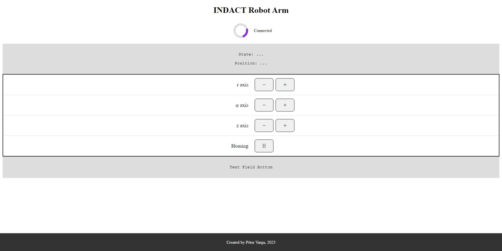
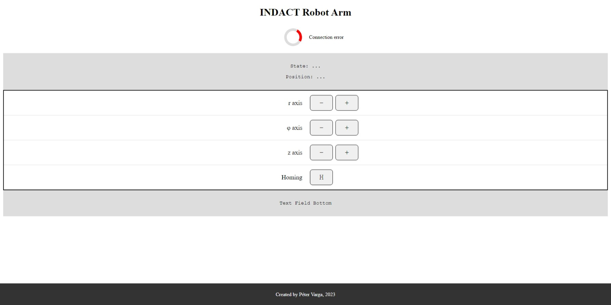
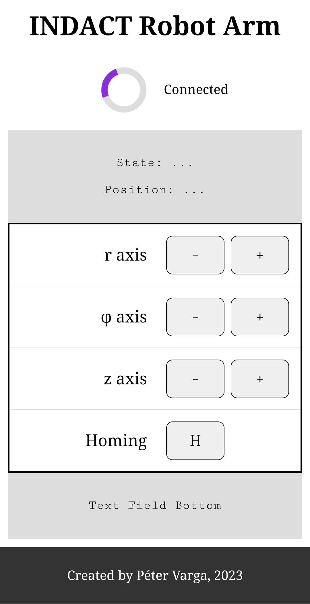

# INDACT Wi-Fi module

*This is the documentation of the Wi-Fi module for the INDACT robotic arm project.*

## About the project

The Wi-Fi module provides a wireless control interface for the INDACT robotic arm. It is based on an ESP8266 Wi-Fi module and the Arduino framework.

The module is designed to be easily integrated into the INDACT robotic arm. It is connected to the arm's control board via a serial interface. The module can be powered from the arm's control board or from an external power supply.

The module provides a web interface for controlling the arm. The web interface is served from the module itself. The module can also be controlled via a custom web API.

## Hardware requirements

This project is designed to work with an ESP8266 Wi-Fi module. Any ESP8266 module can be used, but some modifications may be needed to adapt the project to the specific module. Adaptations can be made in the `include/board_configuration.h` file or the `platformio.ini` file. The module has to be connected to the arm's control board via a serial interface.

For the INDACT project an ESP-01 module is used. For this particular module, the following hardware components are needed:

- ESP8266 Wi-Fi module: ESP-01
- Power supply for the Wi-Fi module: 3.3 V; provided by the arm's control board
- 2 wires for UART communication with the main controller
- 1 optional LED for status indication
- Resistors for the LED and for pull-up/down of certain pins

## Software requirements

### Libraries

The Wi-Fi module is based on the Arduino framework. The following libraries are used:

- [C++ Standard Library](https://en.cppreference.com/w/cpp/standard_library "C++ Standard Library on cppreference.com")
- [ESP8266 Arduino Core](https://github.com/esp8266/Arduino "ESP8266 Arduino Core on GitHub")
- [ESPAsyncTCP](https://github.com/me-no-dev/ESPAsyncTCP "ESPAsyncTCP on GitHub")
- [ESPAsyncWebServer](https://github.com/me-no-dev/ESPAsyncWebServer "ESPAsyncWebServer on GitHub")

### Development environment

For uploading the firmware to the module, the most convenient way is to use the [Arduino IDE](https://www.arduino.cc/en/software "Arduino IDE"). The Arduino IDE can be used to install the ESP8266 Arduino Core library as well. For the development of the firmware, the [Visual Studio Code](https://code.visualstudio.com/ "Visual Studio Code") editor was used with the [PlatformIO IDE extension](https://platformio.org/ "PlatformIO website").

### File system

Note that the module uses the LittleFS file system. Before uploading the firmware, the file system image has to be built and flashed to the device. To manage the file system, follow the instructions here: for [Arduino IDE](https://arduino-esp8266.readthedocs.io/en/latest/filesystem.html#uploading-files-to-file-system "Arduino ESP8266 filesystem documentation") or for [PlatformIO](https://docs.platformio.org/en/latest/platforms/espressif8266.html#uploading-files-to-filesystem "PlatformIO documentation").

## Usage

### I. Web user interface

The web user interface is served from the module itself, as it acts as a web server. The web interface can be accessed from any device that is connected to the same network as the module or directly to the module's Wi-Fi access point.

To see the web interface, open the module's IP address in a web browser. The IP address can be found in the module's serial output or in the router's DHCP client list. The default IP address for the access point is `192.168.4.1`. With the default address, the web interface can be accessed at `http://192.168.0.4/`. The port number is 80, so it does not have to be specified in the URL.

The web interface provides a control panel for the arm. It was designed to be customizable so that the control interface can be adapted to the specific needs of the user. However, the layout of the control panel is fixed. The control panel consists of the following customizable elements:

- **Page header** - The page header should contain the name of the control panel.
- **Top text field** - The top text field can be used to display any text. It can be used to display information about the current state of the arm.
- **Bottom text field** - The bottom text field can be used to display any text. It can be used to display information about the current state of the arm.
- **Control table** - The control table contains the control elements. Each row of the table contains a control element. The control elements can be buttons, sliders, or text fields. The control elements can be used to control the arm. The control elements can be configured to send custom commands to the arm's control board. The control elements can also be configured to display custom text in the top or bottom text fields.
- **Optional script** - The optional script can be used to execute custom JavaScript code. This can be used to implement custom functionality.

The customization of the control panel is done by sending JSON strings to the module through the serial interface. There are two types of these string: layout configuration and data update. The layout configuration is sent only once, when the webpage is loaded. The data update is sent periodically, when it is requested by the webpage.

Here is an example for the JSON that is used to configure the webpage:

```json
{
    "title": "some string",
    "page_header": "some string",
    "text_field_top": [
        "paragraph1",
        "paragraph2"
    ],
    "text_field_bottom": [
        "paragraph1",
        "paragraph2"
    ],
    "control_table": [
        {
            "row_label": "control 1",
            "row_control": "<button>button1</button>"
        },
        {
            "row_label": "control 2",
            "row_control": "<button>button2</button>"
        }
    ],
    "user_script": "some JavaScript code for handling the button clicks"
}
```

To modify the webpage, edit the `data/gui_main.html` file. This file contains the HTML, CSS, and JavaScript code of the webpage. The webpage is served from the module's file system. To manage the file system refer to the [File system](#file-system) section.

Here are some example views of the web interface:




### II. Web API

The web API can be used to control the arm from any device that is connected to the same network as the module or directly to the module's Wi-Fi access point. The web API can be accessed at `http://<module IP address>/action`.

Any text that comes after the `/action` part of the URL is forwarded to the main controller as is. The interpretation of the text is up to the main controller.

### III. Serial interface

The module can be controlled via its serial interface. The UART settings are the following: 115200 baud, 8 data bits, 1 stop bit, no parity, no flow control.

The communication protocol is text-based. The module expects a message frame with a beginning and an end marker. The beginning marker is the `"+_"` string, while the end marker is the `"*_"` string. The message frame can contain a command and a parameter. The command and the parameter are separated by a space character. The message frame can be up to 1024 characters long.

The following commands are supported:

- **`RESET`** - Resets the module. Expects no parameter.
- **`SYNCHRONIZE`** - Synchronizes the module with the main controller. Expects no parameter.
- **`CONNECT_STATION`** - Connects the module to a Wi-Fi network. Expects no parameter. The SSID and the password of the network has to be set before calling this command.
- **`SETUP_ACCESS_POINT`** - Sets up the module as a Wi-Fi access point. Expects no parameter. If the SSID and the password of the access point are not set, the default values are used.
- **`SSID <SSID>`** - Sets the SSID of the Wi-Fi network. Expects the SSID as a parameter. The SSID can be up to 32 characters long.
- **`PASSWORD <password>`** - Sets the password of the Wi-Fi network. Expects the password as a parameter. The password must be at least 8 characters long.
- **`CONFIGURE_LAYOUT <layout>`** - Configures the layout of the web interface. Expects the layout as a parameter. The layout is a JSON string that contains the configuration of the control panel. The layout is described in detail in the [Web user interface](#i-web-user-interface) section.
- **`UPDATE_DATA <data>`** - Updates the data of the web interface. Expects the data as a parameter. The data is a JSON string that contains the data of the control panel. The data is described in detail in the [Web user interface](#i-web-user-interface) section.

The module can respond with a message frame as well. The response can be either of the following:

- **`OK`** - Confirmation message. This is the response when a command is recognized or the command was executed successfully.
- **`FAIL`** - Error message. This is the response when a command is not recognized or the command was not executed successfully.
- **`IP <IP address>`** - IP address message. This is the response when the module is connected to a Wi-Fi network. The IP address of the module is sent as a parameter.
- **`ACTION <action>`** - Action message. When the module receives an action via the web interface, the action is sent in the form of this message. The action string is sent as the parameter.

An example for the communication between the module and the main controller (set network parameters, then connect to the network):

```text
   MCU : +_SSID my_network*_
MODULE : +_OK*_
   MCU : +_PASSWORD my_password*_
MODULE : +_OK*_
   MCU : +_CONNECT_STATION*_
MODULE : +_OK*_
MODULE : +_IP 192.168.0.2*_
```

## Source code

The source code of the Wi-Fi module is located in the `RobotArmWifi` folder.

The code is documented with [Doxygen](https://www.doxygen.nl/index.html "Doxygen website"). The documentation can be generated with the `Doxyfile` configuration file. To generate the documentation with Doxygen, the Doxygen tool is needed. To install Doxygen, visit the [Doxygen website](https://www.doxygen.nl/index.html "Doxygen website").

The documentation can be generated with the following command:

```bash
doxygen Doxyfile
```
