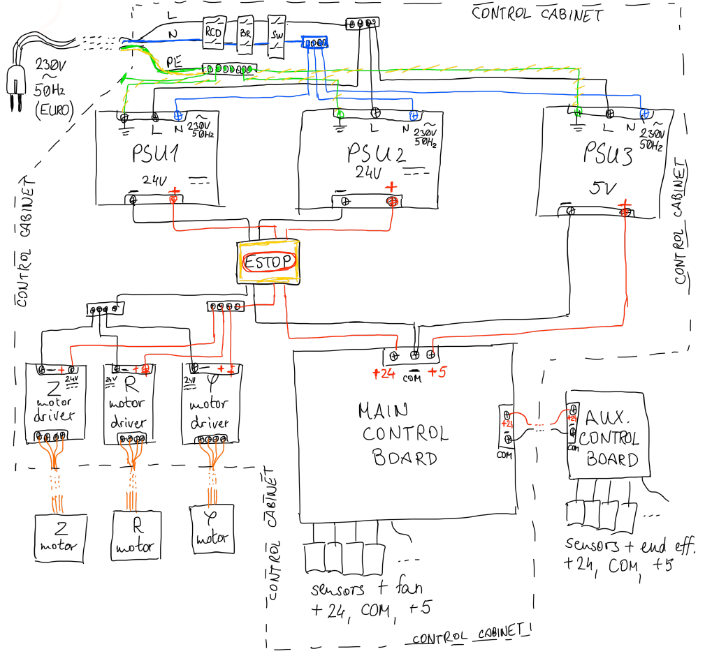
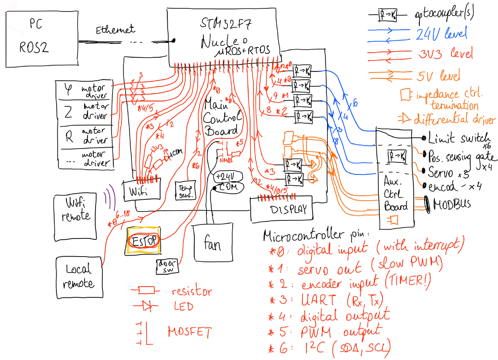
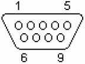
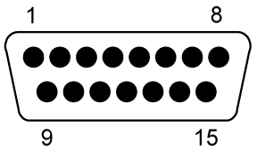

% **Industrial robot arm hardware documentation**

***

This document describes the hardware aspect (mechanical construction, power distribution and control circuitry) of the industrial robot arm (nicknamed "Karcsi") made by the INDACT project of LEGO Kör.

# Mechanical construction

> TODO complete this section with mCAD models and diagrams

The robot arm is constructed from extruded aluminium profiles, machined stainless steel plates, aluminium spacer rods, and held together with screws. A vertical profile and a paralel ball screw are mounted on a rotary base, forming the **Z axis** of the arm's movement. A carriage riding on this profile is connected to another, horizontal profile, which forms the **R axis**. The end-effector, currently a 3D-printed mechanical hand with 5 fingers, is attached to one end of the R axis profile.

The base enables rotary movement (**Phi axis**), realised by a stepper motor and belt-drive. The Z axis movement is realised by a stepper motor, mounted at the upper end of the Z axis profile, driving the ball screw. The R axis movement is realised by a stepper motor mounted on the carriage, driving a studded belt fastened to the R axis profile, similarly to how some laser-engravers and 3D printers move. The movement of the fingers is realised by 3 servos inside the palm section of the hand assembly.

We plan to extend the arm's movement capabilities by introducing up to 3 more degrees of freedom through a wrist assembly that would enable tilting (Alpha, Beta axes) and rotation (Theta axis) of the end-effector. A possible upgrade to interchangeable, MODBUS-based smart end-effectors is also planned.

# Power distribution

The arm is powered from the European power grid (**single-phase 230V 50Hz AC**) through the Electronics Box. This enclosure is equipped with a RCD, circuit breaker, mains switch, and 3 separate, galvanically isolated switch-mode AC-to-DC power supplies:

* **PSU1** supplies +24V DC to the stepper motor drivers, is sized to continuously withstand the high currents the motors draw, and wired directly to the motor drivers in the Electronics Box.
* **PSU2** supplies +24V DC to the control electronics, for long distance signal wiring, powering a cooling fan, and optical isolation. This 24V power line is routed through the Main Control Board and auxiliary control boards. The auxiliary control boards derive their own 5V power from PSU2 with switch-mode 24VDC-to-5VDC Buck converters.
* **PSU3** supplies +5V DC to the control electronics, to power digital control and measurement circuitry. This 5V power line is routed through the Main Control Board. The Main Control Board creates a 3.3V supply rail for logic-level circuitry with a 5V-to-3V3 Low-Dropout linear regulator (LDO).

The **Emergency Stop** (ESTOP) button breaks the PSU1 24V circuit, but not 5V, so the ESTOP event can be logged by the control logic.

The diagram below shows how power is distributed.

# Control and data flow

## The main microcontroller

The arm is mainly controlled and programmed through **ROS** (the Robot Operating System) running on a PC or laptop connected via Ethernet to the Electronics Box. Direct control is possible from a remote (or smartphone web GUI) connected over Wifi, a LeapMotion sensor and application also connected over Wifi, or a wired remote (for debugging and tesing purposes).

An **STM32F7**46ZG microcontroller running **micro-ROS** firmware (located on a **Nucleo-F746** development board, connected to the Main Control Board via pin headers) performs low-level control and telemetry data collection:

* Communicates with the **host PC over Ethernet**
* Controls the **motor drivers** for the Phi, R, Z (and optionally Theta) axes
* Controls the current, hand-like  **end-effector's servos**
* Measures and reports the movement speed and position of the arm, through **limit switches, position sensing gates and motor encoders**
* Communicates with the Wifi remote through an **ESP-01 Wifi module**
* Handles **Emergency Stop** events, the **Electronics Box being opened** during operation, or a limit switch being triggered, and stops the arm according to the given rules
* Regulates the temperature of the Electronics Box through two **fans and a temperature sensor**
* Communicates with any future smart end-effector over **MODBUS** (TIA/EIA-485)
* Handles the **wired remote** button inputs.
* Displays status and error messages on a 2x16 **character lCD**
* Provides additional expansion capability through **SPI and GPIO** ports

The specific microcontroller and development board were chosen due to ROS and Ethernet support, and part availability considerations.

Detailed information (including datasheet) about the microcontroller can be found [here](https://www.st.com/en/microcontrollers-microprocessors/stm32f746zg.html#documentation "STM32F746 documentation"). Documentation for the Nucleo-F746 development board can be found [here](https://www.st.com/en/evaluation-tools/nucleo-f746zg.html#documentation "Nucleo documentation").

## Peripherals

* The STM32F7 microcontroller can only read 4 separate encoders (due to timer limitations), so for complete and precise control in 6 degrees of freedom, an additional Cortex-M0-based, smaller microcontroller may be soldered directly to the Main Control Board, to extend the timer capabilities of the Nucleo, and thus control the planned **Alpha and Beta axes**, and report back their position and speed. This microcontroller communicates with the Nucleo over I2C. For this task, the **STM32F030K6Tx** microcontroller was selected. It is readily available, affordable, and has enough peripherals for controlling 2 motors.
* The Wifi remote and LeapMotion application connect over Wifi to an ESP-01 Wifi module, connected to the Nucleo over a full-duplex serial (UART) connection (and 4 additional GPIO control signals).
* The wired remote features one pushbutton for each direction of each axis and servo, up to 18 in total, pulling a corresponding GPIO input to ground.
* All axes feature limit switches to prevent movement outside the safe operating movement range. These are all connected to correspoding GPIO pins.
* Some axes feature additional position sensing gates to aid the robot in determining its position and define a home position. These are all connected to corresponding GPIO pins.
* The Nucleo development board features built-in Ethernet and USB-OTG connectivity, 3 programmable LED outputs, 2 pushbutton inputs, and JTAG and ST-LINK programming interfaces.
* Each axis requires a motor driver (located in the Electronics Box), which are controlled with Step, Direction and Enable signals for each. Direction and Enable signals are simple GPIO outputs, but Step signals need to be generated with timers, preferably a separate timer for each axis. The steper motors connect directly to the motor drivers.
* The 3 servos of the end-effector are controlled by PWM signals, one each. These can be from the same timer.
* All axes feature encoders to accurately measure the rotational speed and angle of the motors. These require 2 channels of an encoder-compatible timer each.
* The Electronics Box cooling fans are PWM-controlled through a MOSFET, and thus require one channel of any one timer.
* The character LCD module is connected to the Nucleo over a 11-pin paralel GPIO interface, and its backlight LED is PWM-controlled through a MOSFET (also requiring one channel of any one timer).
* The Electronics Box internal temperature is measured with a BME-280 temperature sensor, connected to the Nucleo over I2C.
* The ESTOP button, and the switch detecting the Electronics Box being open, both pull one GPIO pin each to ground.
* For intercompatibility with future smart end-effectors, a MODBUS (TIA/EIA-485, full-duplex differential UART) link is provided from the Nucleo, through a TIA/EIA-485 transceiver.

For better signal integrity, electrical safety, reliability and ESD-protection, all low-current signals travelling long distances (encoders, position sensing gates, limit switches, end-effector servos) are optically isolated on both ends, and shifted to 24V levels.
The MODBUS link does not require optical isolation, as it uses a shielded, impedance-controlled, duplex differential twisted pair trunk cable terminated on both ends, operating at 5V line levels, and all devices on it connect via line driver buffers (TIA/EIA-485 transceivers). This works well in the industry for distances over kilometers long, and rather noisy environments. More info can be found [here](https://modbus.org/docs/Modbus_over_serial_line_V1_02.pdf "MODBUS over Serial documentation")

The diagram below shows how control signals and peripherals are connected.

Microcontroller connections for the Nucleo board:

| Peripheral | Type of connection | Optical isolation | Number of connections |
| :--------: | :----------------: | :---------------: | :------------------------ |
| Limit switch | digital input | yes | 8 (R, Z, Phi, Theta axes, 2 each) |
| Position sensing gate | digital input | yes | 2 (R, Z axes, 1 each) |
| Encoder | 32-bit timer digital input | yes | 8 (R, Z, Phi, Theta axes, 2 wires each) |
| Temperature sensor | I2C master | no | 2 (SDA, SCL) |
| Secondary microcontroller | I2C master | no | 2 (SDA, SCL) |
| ESTOP button | digital input | no | 1 |
| Door switch | digital input | no | 1 |
| Wired remote buttons | digital input | no | 6...18 (all axes and servos, 2 each) |
| Cooling fan | PWM output | no | 1 |
| Stepper motor driver | digital and PWM output | no | 12 (R, Z, Phi, Theta axes, 3 wires each) |
| Servo | PWM output | yes | 3 (3 servos, 1 wire each) |
| Display | paralel digital input-output and PWM output | no | 11+1 (paralel IO + backlight) |
| Wifi module | UART and digital output | no | 4 (Rx, Tx, CH-PD, Reset) |
| MODBUS link | UART | no | 2 (Rx, Tx) |
| SPI expansion | SPI | no | 4 (SCL, MISO, MOSI, NSS) |
| Nucleo Ethernet | built-in | no | built-in |
| Nucleo Reset, boot, oscillators and buttons | built-in | no | built-in |
| Nucleo USB-OTG | built-in | no | built-in |
| Nucleo LEDs | built-in | no | built-in |
| Nucleo SWD / ST-LINK programming | built-in | no | built-in |

Microcontroller connections for the secondary STM32F0 microcontroller:

| Peripheral | Type of connection | Optical isolation | Number of connections |
| :--------: | :----------------: | :---------------: | :------------------------ |
| Primary microcontroller (Nucleo) | I2C slave | no | 2 (SDA, SCL) |
| Limit switch | digital input | yes | 4 (Alpha, Beta axes, 2 each) |
| Encoder | 32-bit timer digital input | yes | 4 (Alpha, Beta axes, 2 wires each) |
| Stepper motor driver | digital and PWM output | no | 6 (Alpha, Beta axes, 3 wires each) |
| SWD programming | Serial Wire Debug | no | 2 (SWCLK, SWDIO) |
| Reset and boot pins | NRST, BOOT0 special inputs | no | 2 |
| HSE crystal oscillator | RCC pins | no | 2 |

## Pinout and IO configuration

The table below contains pinout information for the STM32F746 Nucleo board.

| Pin | Function | Notes |
| --: | :------- | :---- |
| PA0 | TIM2_CH1 | End-effector Servo 1 PWM control |
| PA1 | RMII_Ref_CLK | Ethernet (built-in) |
| PA2 | RMII_MDIO | Ethernet (built-in) |
| PA3 | TIM2_CH4 | End-effector Servo 2 PWM control |
| PA4 | SPI3_NSS | Expansion SPI Slave-Select |
| PA5 | GPIO_IN | Phi axis Pushbutton for Counterclockwise movement |
| PA6 | TIM3_CH1 | Z axis Encoder A |
| PA7 | RMII_CRS | Ethernet (built-in) |
| PA8 | USB_SOF | USB (built-in) |
| PA9 | USB_VBUS | USB (built-in) |
| PA10 | USB_ID | USB (built-in) |
| PA11 | USB_DM | USB (built-in) |
| PA12 | UDB_DP | USB (built-in) |
| PA13 | SWD_TMS | Serial Wire Debug programming (built-in) |
| PA14 | SWD_TCK | Serial Wire Debug programming (built-in) |
| PA15 | GPIO_IN | Phi axis Pushbutton for Clockwise movement |
| PB0 | LED1 | Green LED (built-in) |
| PB1 | GPIO_IN | Z axis Pushbutton for Up movement |
| PB2 | SPI3_MOSI | Expansion SPI MOSI (DO) |
| PB3 | SW0 | programming switch (built-in) |
| PB4 | GPIO_OUT | Phi axis stepper motor driver Direction |
| PB5 | TIM3_CH2 | Z axis Encoder B |
| PB6 | GPIO_OUT | Phi axis stepper motor driver Enable |
| PB7 | LED2 | Blue LED (built-in) |
| PB8 | TIM10_CH1 | Phi axis stepper motor driver Step PWM control |
| PB9 | TIM11_CH1 | Theta axis stepper motor driver Step PWM control |
| PB10 | TIM2_CH3 | End-effector Servo 3 PWM control |
| PB11 | GPIO_IN | Z axis Pushbutton for Down movement |
| PB12 | GPIO_IN | R axis Pushbutton for Outward movement |
| PB13 | RMII_TXD1 | Ethernet (built-in) |
| PB14 | LED3 | Red LED (built-in) |
| PB15 | GPIO_IN | R axis Pushbutton for Inward movement |
| PC0 |  |  |
| PC1 | RMII_MDC | Ethernet (built-in) |
| PC2 | GPIO_IN | Theta axis Pushbutton for Counterclockwise movement |
| PC3 | GPIO_IN | Theta axis Pushbutton for Clockwise movement |
| PC4 | RMII_RXD0 | Ethernet (built-in) |
| PC5 | RMII_RXD1 | Ethernet (built-in) |
| PC6 | TIM8_CH1 | Theta axis Encoder A |
| PC7 | TIM8_CH2 | Theta axis Encoder B |
| PC8 | GPIO_IN | End-effector Servo 1 Pushbutton for curl finger movement |
| PC9 | GPIO_IN | End-effector Servo 1 Pushbutton for straighten finger movement |
| PC10 | SPI3_CLK | Expansion SPI clock |
| PC11 | SPI3_MISO | Expansion SPI MISO (DI) |
| PC12 | UART5_TX | MODBUS transmit |
| PC13 | USER_BTN | Pushbutton (built-in) |
| PC14 | RCC_OSC32_IN | 32 MHz oscillator (built-in) |
| PC15 | RCC_OSC32_OUT | 32 MHz oscillator (built-in) |
| PD0 | GPIO_IN | Phi axis Limit switch 1 |
| PD1 | GPIO_IN | Phi axis Limit switch 2 |
| PD2 | UART5_RX | MODBUS receive |
| PD3 | GPIO_IN | Z axis limit switch 1 |
| PD4 | GPIO_IN | Z axis limit switch 2 |
| PD5 | GPIO_IN | R axis Limit switch 1 |
| PD6 | GPIO_IN | R axis Limit switch 2 |
| PD7 |  |  |
| PD8 | STLK_RX | ST-link (built-in) |
| PD9 | STLK_TX | ST-link (built-in) |
| PD10 | GPIO_IN | End-effector Servo 2 Pushbutton for curl finger movement |
| PD11 | GPIO_IN | End-effector Servo 2 Pushbutton for straighten finger movement |
| PD12 | TIM4_CH1 | R axis Encoder A |
| PD13 | TIM4_CH2 | R axis Encoder B |
| PD14 | GPIO_IN | End-effector Servo 3 Pushbutton for curl finger movement |
| PD15 | GPIO_IN | End-effector Servo 3 Pushbutton for straighten finger movement |
| PE0 | UART8_RX | Wifi module serial receive |
| PE1 | UART8_TX | Wifi module serial transmit |
| PE2 | GPIO_OUT | Wifi module CH_PD |
| PE3 | GPIO_OUT | Wifi module Reset |
| PE4 |  |  |
| PE5 | TIM9_CH1 | Z axis stepper motor driver Step PWM control |
| PE6 | TIM9_CH2 | R axis stepper motor driver Step PWM control |
| PE7 | GPIO_OUT | Z axis stepper motor driver Direction |
| PE8 | GPIO_OUT | Z axis stepper motor driver Enable |
| PE9 | TIM1_CH1 | Phi axis Encoder A |
| PE10 | GPIO_OUT | R axis stepper motor driver Direction |
| PE11 | TIM1_CH2 | Phi axis Encoder B |
| PE12 | GPIO_OUT | R axis stepper motor driver Enable |
| PE13 | TIM1_CH3 | Cooling fan PWM control |
| PE14 | TIM1_CH4 | LCD backlight PWM control |
| PE15 |  |  |
| PF0 | I2C2_SDA | Temperature sensor data |
| PF1 | I2C2_SCL | Temperature sensor clock |
| PF2 |  |  |
| PF3 | GPIO_OUT | LCD Data (H) / Command (L) |
| PF4 | GPIO_OUT | LCD Read-Write (MCU->LCD H, LCD->MCU L) |
| PF5 | GPIO_OUT | LCD Enable |
| PF6 | GPIO_OUT | LCD paralel data 0 |
| PF7 | GPIO_OUT | LCD paralel data 1 |
| PF8 | GPIO_OUT | LCD paralel data 2 |
| PF9 | GPIO_OUT | LCD paralel data 3 |
| PF10 | GPIO_OUT | LCD paralel data 4 |
| PF11 | GPIO_OUT | LCD paralel data 5 |
| PF12 | GPIO_OUT | LCD paralel data 6 |
| PF13 | GPIO_OUT | LCD paralel data 7 |
| PF14 | I2C4_SCL | Secondary microcontroller (STM32F0) data |
| PF15 | I2C4_SCL | Secondary mocrocontroller (STM32F0) clock |
| PG0 | GPIO_EXTI0 | ESTOP interrupt input |
| PG1 | GPIO_IN | Door switch input |
| PG2 | GPIO_IN | Z axis Position sensing gate |
| PG3 | GPIO_IN | Phi axis Position sensing gate |
| PG4 | GPIO_IN | R axis Position sensing gate |
| PG5 | GPIO_IN | Theta axis Position sensing gate |
| PG6 | GPIO_OUT | ? |
| PG7 | USB_OverCurrent | USB (built-in) |
| PG8 | GPIO_IN | Theta axis limit switch 1 |
| PG9 | GPIO_IN | Theta axis limit switch 2 |
| PG10 |  |  |
| PG11 | RMII_TX_EN | Ethernet (built-in) |
| PG12 |  |  |
| PG13 | RMII_TXD0 | Ethernet (built-in) |
| PG14 | GPIO_OUT | Theta axis stepper motor driver Direction |
| PG15 | GPIO_OUT | Theta axis stepper motor driver Enable |
| PH0 | RCC_OSC_IN | Bypass oscillator (built-in) |
| PH1 | RCC_OSC_OUT | Bypass oscillator (built-in) |
| PDR | Power-down Reset | (built-in) |
| BOOT0 | Boot selector | (built-in) |
| NRST | System reset | (built-in) |

* The MODBUS link uses UART5 with the following parameters: Baudrate 19200, 8 data bits, even parity, 1 stop bit.
* The Wifi module uses GPIO pins PE2, PE3 and UART8 with the following parameters: `TODO fill ESP-01 UART parameters`
* The 16x2 character LCD module uses GPIO pins PF5-PF15 for its paralel interface, and its backlight is PWM controlled using TIMER1, CH4.
* The temperature sensor uses I2C2.
* The cooling fan is PWM controlled using TIMER1, CH3.
* The Phi, Z, R, Theta axis encoders use timers TIMER1, TIMER3, TIMER4 and TIMER8, respectively, in Encoder mode.
* The end-effector servos are PWM controlled using TIMER2.
* The Z and R axis position sensing gates use GPIO pins PG2-PG5 as inputs, with internal pull-up.
* The Emergency Stop (ESTOP) button uses GPIO pin PG0 as input, with internal pull-up, and interrupt EXTI0 on falling edge.
* The Electronics Box door switch uses GPIO pin PG1 as input, with internal pull-up.
* The Phi, Z, R axis limit switches use GPIO pins PD0-PD1, PD3-PD4, PD5-PD6, respectively, as inputs, with internal pull-up.
* The Phi axis stepper motor driver uses TIMER10, CH1 for its Step (PWM) signal, and GPIO pins PB4, PB6, respectively, for its Direction and Enable signals. The Z axis stepper motor driver uses TIMER9, CH1 for its Step (PWM) signal, and GPIO pins PE7, PE8 for its Direction and Enable signals. The R axis stepper motor driver uses TIMER9, CH2 for its Step (PWM) signal, and GPIO pins PE10, PE12 for its Direction and Enable signals. The planned Theta (wrist rotation) axis stepper motor driver uses TIMER11, CH1 for its Step (PWM) signal, and GPIO pins PG14 and PG15 for its Direction and Enable signals.
* The expansion SPI interface is SPI3, in full-duplex Master mode, with hardware NSS output.
* The wired remote (one pushbutton for each direction of each axis) uses GPIO pins PA5 (Phi CCW), PA15 (Phi CLW), PB1 (Z up), PB11 (Z down), PB12 (R extend), PB15 (R retract), PC2 (Theta CCW), PC3 (Theta CLW), PC8 (Servo 1 curl), PC9 (Servo 1 straighten), PD10 (Servo 2 curl), PD11 (Servo 2 straighten), PD14 (Servo 3 curl), PD15 (Servo 3 straighten), as inputs, with internal pull-up.
* The rest of the GPIO pins (PC0, PD7, PE4, PE15, PF2, PF3, PF4, PG8, PG9, PG12) are routed to connectors on the Main Control Board, for the possibility of future expansion.

The table below contains pinout information for the STM32F030K6TX secondary microcontroller.

| Pin | Function | Notes |
| --: | :------- | :---- |
| PA0 | GPIO_IN | Alpha axis Limit switch 1 |
| PA1 | GPIO_IN | Alpha axis Limit switch 2 |
| PA2 | GPIO_IN | Beta axis Limit switch 1 |
| PA3 | GPIO_IN | Beta axis Limit switch 2 |
| PA4 | TIM14_CH1 | Alpha axis stepper motor driver Step PWM control |
| PA5 | GPIO_IN | Alpha axis Pushbutton 1 |
| PA6 | TIM16_CH1 | Beta axis stepper motor driver Step PWM control |
| PA7 | TIM3_CH2 | Beta axis Encoder B |
| PA8 | TIM1_CH1 | Alpha axis Encoder A |
| PA9 | TIM1_CH2 | Alpha axis Encoder B |
| PA10 | I2C1_SDA | Primary microcontroller (Nucleo) data |
| PA11 | GPIO_IN | Alpha axis Pushbutton 2 |
| PA12 | GPIO_IN | Beta axis Pushbutton 1 |
| PA13 | SWDIO | Serial Wire Debug programming |
| PA14 | SWCLK | Serial Wire Debug programming |
| PA15 | GPIO_IN | Beta axis Pushbutton 2 |
| PB0 | GPIO_OUT | Alpha axis stepper motor driver Direction |
| PB1 | GPIO_OUT | Alpha axis stepper motor driver Enable |
| PB2 | does not exist | |
| PB3 | GPIO_OUT | Beta axis steper motor driver Direction |
| PB4 | TIM3_CH1 | Beta axis Encoder A |
| PB5 | GPIO_OUT | Beta axis stepper motor driver Enable |
| PB6 | I2C1_SCL | Primary microcontroller (Nucleo) clock |
| PB7 |  |  |
| PF0 | RCC_OSC_IN | External high-speed oscilaltor |
| PF1 | RCC_OSC_OUT | External high-speed oscillator |
| BOOT0 | Boot selector | jumper to select between running and programming |
| NRST | System reset | SWD reset, Nucleo reset (through transistor), RC network, reset jumper |

# Electrical Design

The electronics operating the arm are categorised by location as follows:

1. The Electronics Box
    1. Mains voltage circuitry
        * Mains power input connector (P09)
        * RCD
        * 6A circuit breaker
        * Mains power switch
        * Protective Earth connection
        * Line and Neutral distribution blocks
    2. Galvanically isolated power supplies
        * PSU1: 24V DC, wired directly to motor drivers
        * PSU2: 24V DC, supplied to Main Control Board and further distributed to Auxiliary Control Boards
        * PSU3: 5V DC, supplied to the Main Control Board
    3. Motor drivers
        * Phi axis: stepper
        * Z axis: stepper
        * R axis: stepper

            > All stepper drivers have optically isolated Step (PUL+), Direction (DIR+), Enable (ENA+) inputs referencing PSU3 common point (PUL-, DIR-, ENA-); Stepper motor A+, A-, B+, B- connections; and 24V power connections (directly wired to PSU1).

        * Empty space for planned Theta, Alpha, Beta axes motor drivers (BLDC or stepper)
    3. The Main Control Board
        * Nucleo-F746 development board {Nucleo-morpho pin header}
        * secondary STM32F030K6TX microcontroller and related circuitry (capacitors, crystal oscillators, SWD programming (P08), Boot configuration, etc.) {optionally soldered on when Alpha and Beta axes are implemented}
        * 5V to 3.3V Low-Dropout (LDO) linear regulator (LM3940IMP-3.3/NOPB)
        * Filtering and decoupling ceramic capacitors, bulk decoupling electrolytic capacitors
        * ESD protection
        * MODBUS differential line buffer (SN75LBC179AD) and termination with pull-up and pull-down resistors and grounded shielding, Rx and Tx routed as impedance-controlled diff. pairs {P04a, DB-9 serial connector}
        * ESP-01 Wifi module (3.3V power, UART, GPIO2 connected through a blue LED and series resistor to ground, GPIO0 connected through an 1k resistor to 3.3V supply) {2x4 pin header}
        * BME-280 temperature sensor module (3.3V power, I2C) {1x4 pin header}
        * 2x16 character LCD module (3.3V power, 11-wire paralel interface, contrast setting with trimmer potentiometer between 3.3V and ground, backlight LED PWM-controlled through N-channel MOSFET (BSS123) and series resistor) {1x16 pin header}
        * N-channel MOSFET to PWM-control cooling fans (BSS123)), {two 2-pin fan headers wired in paralel}
        * SFH6345 digital optocouplers for limit switch, encoder, position gate signals (input 3.3V from Nucleo or secondary microcontroller, 
        * Screw terminals for power input (24V, COM_PSU2, 5V, COM_PSU3), ESTOP (COM_PSU3, GPIO), Electronics Box door switch (COM_PSU3, GPIO), motor driver control signals (6x3 GPIO + 6x COM_PSU3)
        * P05a DB-25 connector to wired remote (18 GPIOs, 7x COM_PSU3)
        * Conenction to Aux Control Boards and smart end-effector (detailed in section 2 of this list) (24V power, encoder, limit switch, position gate GPIOs, servo PWM signals, MODBUS) (P03a DB-37 connector for sensor signals, PSU2 24V power and COM_PSU2; P04a DB-9 connector for MODBUS and servos)
    4. Other miscellania
        * 2 cooling fans wired in paralel
        * Electronics Box lid open switch
        * ESTOP button
        * status LCD (2x16 character)
        * C14 Mains power connector (P9)
        * USB and Externet connectors of the Nucleo (P06, P07)
        * P01a, P02a DB-25 connectors for the stepper motor connections
        * Mounting hardware
3. Mounted in the robot arm base
    1. Aux. Control Board 1: mounted inside the robot arm base
        * 24V to 5V Buck converter and 5V to 3.3V LDO, LED indicator
        * decoupling capacitors
        * SFH6345 optocouplers for Phi axis encoder (2x), Phi axis limit switch (2x), Phi axis position gate (1x) signals
        * connection to Phi axis encoder, Phi axis limit switches, Phi axis position gate (vertical pin headers)
        * connection to Aux. Control Board 2 (P10a, DB-15 socket) and Aux. Control Board 3 (P11a, DB-25 socket)
        * connection to Electronics Box (P03d, DB-37 pin)
2. Mounted near the Z axis profile
    1. Aux. Control Board 2: mounted on the back of the Z axis profile approx. in the middle
        * 24V to 5V Buck converter and 5V to 3.3V LDO, LED indicator
        * decoupling capacitors
        * SFH6345 optocouplers for Z axis encoder (2x), Z axis limit switch (2x), Z axis position gate (1x), R axis encoder (2x) signals
        * connection to Z axis encoder, Z axis limit switches, Z axis position sensing gate, R axis encoder (horizontal pin headers)
        * connector to Aux. Control Board 1 (P10d, DB-15 pin)
    2. Z axis stepper motor + Z axis encoder
    4. R axis stepper motor + R axis encoder
    5. Z axis limit switches and position gate
    6. Wiring harness and plastic cable guide
3. Mounted near the R axis profile
    1. Aux. Control Board 3: mounted on the front of the R axis profile towards the end-effector
        * 24V to 5V Buck converter and 5V to 3.3V LDO, LED indicator
        * decoupling capacitors
        * SFH6345 optocouplers for R axis limit switch (2x), R axis position gate (1x), Theta axis encoder (2x), Theta axis limit switch (2x), Theta axis position gate (1x), Alpha axis encoder (2x), Alpha axis limit switch (2x), Beta axis encoder (2x), Beta axis limit switch (2x), End-effector servo PWM (3x) signals
        * connection to end-effector servos, Alpha, Beta and Theta axis encoders, R, Alpha, Beta and Theta axis limit switches, R axis position gate (horizontal pin headers)
        * MODBUS termination (without pull-up and pull-down resistors and shield connection), line driver (TIA/EIA-485 transceiver), P04f DB-9 pin connector input (with servos), output to end-effector P13 DB-9 socket connector (original MODBUS)
        * connector to Aux. Control Board 1 (P11d, DB-25 pin)
    2. R axis limit switches and position gate
    3. Alpha, Beta and Theta axis motors (planned), with encoders and limit switches
    4. Wiring harness and platic cable guide on the back
    5. End-effector mount

The Main Control Board and Auxiliary Control Boards are designed in KiCAD. The Main Control Board is designed and manufactured as a 4-layer PCB. The Aux. Control Boards are designed and manufactured together as a single, 2-layer, perforated PCB, and separated later along the perforated edge. All boards are assembled and tested in-house by project members.

Connector pinouts are marked on boards, and most connectors used can only be connected in the correct orientation.

## Connector pinouts

> All pinout drawings show the pin (male) variant, viewed head-on from the socket-facing side.

1. P01a: DB-25 socket connector on the back of the Electronics Box, color-coded **RED**.
    
    
    - Counterparts P01b is a DB-25 pin connector on the red motor cable, P01c is a DB-25 socket connector on the other end of the red motor cable, and P01d is a DB-25 pin connector in the robot arm base (near Phi axis), from which the motor connections to the Phi, Z, R axes are directly wired.
    - "Main motors": connecting R, Z and Phi axis stepper motors to their motor drivers
    
    <table>
        <thead>
            <tr>
                <th>Pin</th>
                <th>Function</th>
                <th>Note</th>
            </tr>
        </thead>
        <tbody>
            <tr>
                <td>1</td>
                <td>COM_MOT</td>
                <td>Motor side common point of motor drivers</td>
            </tr>
            <tr>
                <td>2</td>
                <td rowspan=2>Phi_A+</td>
                <td rowspan=2>Phi axis stepper motor A winding positive</td>
            </tr>
            <tr>
                <td>3</td>
            </tr>
            <tr>
                <td>4</td>
                <td rowspan=2>Phi_B+</td>
                <td rowspan=2>Phi axis stepper motor B winding positive</td>
            </tr>
            <tr>
                <td>5</td>
            </tr>
            <tr>
                <td>6</td>
                <td rowspan=2>R_A+</td>
                <td rowspan=2>R axis stepper motor A winding positive</td>
            </tr>
            <tr>
                <td>7</td>
            </tr>
            <tr>
                <td>8</td>
                <td rowspan=2>R_B+</td>
                <td rowspan=2>R axis stepper motor B winding positive</td>
            </tr>
            <tr>
                <td>9</td>
            </tr>
            <tr>
                <td>10</td>
                <td rowspan=2>Z_A+</td>
                <td rowspan=2>Z axis stepper motor A winding positive</td>
            </tr>
            <tr>
                <td>11</td>
            </tr>
            <tr>
                <td>12</td>
                <td rowspan=2>Z_B+</td>
                <td rowspan=2>Z axis stepper motor B winding positive</td>
            </tr>
            <tr>
                <td>13</td>
            </tr>
            <tr>
                <td>14</td>
                <td rowspan=2>Phi_A-</td>
                <td rowspan=2>Phi axis stepper motor A winding negative</td>
            </tr>
            <tr>
                <td>15</td>
            </tr>
            <tr>
                <td>16</td>
                <td rowspan=2>Phi_B-</td>
                <td rowspan=2>Phi axis stepper motor B winding negative</td>
            </tr>
            <tr>
                <td>17</td>
            </tr>
            <tr>
                <td>18</td>
                <td rowspan=2>R_A-</td>
                <td rowspan=2>R axis stepper motor A winding negative</td>
            </tr>
            <tr>
                <td>19</td>
            </tr>
            <tr>
                <td>20</td>
                <td rowspan=2>R_B-</td>
                <td rowspan=2>R axis stepper motor B winding negative</td>
            </tr>
            <tr>
                <td>21</td>
            </tr>
            <tr>
                <td>22</td>
                <td rowspan=2>Z_A-</td>
                <td rowspan=2>Z axis stepper motor A winding negative</td>
            </tr>
            <tr>
                <td>23</td>
            </tr>
            <tr>
                <td>24</td>
                <td rowspan=2>Z_B-</td>
                <td rowspan=2>Z axis stepper motor B winding negative</td>
            </tr>
            <tr>
                <td>25</td>
            </tr>
        </tbody>
    </table> 

2. P02a: DB-25 socket connector on the back of the Electronics Box, color-coded **YELLOW**.
    
    
    - Counterparts P02b is a DB-25 pin connector on the yellow motor cable, P02c is a DB-25 socket connector on the other end of the yellow motor cable, and P02d is a DB-25 pin connector in the robot arm base (near Phi axis), from which the motor connections to the Theta, Alpha, Beta axes are directly wired.
    - "Wrist motors": connecting the planned Alpha, Beta and Theta axis stepper motors to their motor drivers
    
    <table>
        <thead>
            <tr>
                <th>Pin</th>
                <th>Function</th>
                <th>Note</th>
            </tr>
        </thead>
        <tbody>
            <tr>
                <td>1</td>
                <td>COM_MOT</td>
                <td>Motor side common point of motor drivers</td>
            </tr>
            <tr>
                <td>2</td>
                <td rowspan=2>Theta_A+</td>
                <td rowspan=2>Theta axis stepper motor A winding positive</td>
            </tr>
            <tr>
                <td>3</td>
            </tr>
            <tr>
                <td>4</td>
                <td rowspan=2>Theta_B+</td>
                <td rowspan=2>Theta axis stepper motor B winding positive</td>
            </tr>
            <tr>
                <td>5</td>
            </tr>
            <tr>
                <td>6</td>
                <td rowspan=2>Alpha_A+</td>
                <td rowspan=2>Alpha axis stepper motor A winding positive</td>
            </tr>
            <tr>
                <td>7</td>
            </tr>
            <tr>
                <td>8</td>
                <td rowspan=2>Alpha_B+</td>
                <td rowspan=2>Alpha axis stepper motor B winding positive</td>
            </tr>
            <tr>
                <td>9</td>
            </tr>
            <tr>
                <td>10</td>
                <td rowspan=2>Beta_A+</td>
                <td rowspan=2>Beta axis stepper motor A winding positive</td>
            </tr>
            <tr>
                <td>11</td>
            </tr>
            <tr>
                <td>12</td>
                <td rowspan=2>Beta_B+</td>
                <td rowspan=2>Beta axis stepper motor B winding positive</td>
            </tr>
            <tr>
                <td>13</td>
            </tr>
            <tr>
                <td>14</td>
                <td rowspan=2>Theta_A-</td>
                <td rowspan=2>Theta axis stepper motor A winding negative</td>
            </tr>
            <tr>
                <td>15</td>
            </tr>
            <tr>
                <td>16</td>
                <td rowspan=2>Theta_B-</td>
                <td rowspan=2>Theta axis stepper motor B winding negative</td>
            </tr>
            <tr>
                <td>17</td>
            </tr>
            <tr>
                <td>18</td>
                <td rowspan=2>Alpha_A-</td>
                <td rowspan=2>Alpha axis stepper motor A winding negative</td>
            </tr>
            <tr>
                <td>19</td>
            </tr>
            <tr>
                <td>20</td>
                <td rowspan=2>Alpha_B-</td>
                <td rowspan=2>Alpha axis stepper motor B winding negative</td>
            </tr>
            <tr>
                <td>21</td>
            </tr>
            <tr>
                <td>22</td>
                <td rowspan=2>Beta_A-</td>
                <td rowspan=2>Beta axis stepper motor A winding negative</td>
            </tr>
            <tr>
                <td>23</td>
            </tr>
            <tr>
                <td>24</td>
                <td rowspan=2>Beta_B-</td>
                <td rowspan=2>Beta axis stepper motor B winding negative</td>
            </tr>
            <tr>
                <td>25</td>
            </tr>
        </tbody>
    </table>

3. P03a: DB-37 socket connector on the back of the Electronics Box, color-coded **BLUE**.
    
    
    - Counterparts P03b is a DB-37 pin connector on the blue signal cable, P03c is a DB-37 socket connector on the other end of the blue signal cable, and P03d is a DB-37 pin connector on Aux. Control Board 1, located in the robot arm base (near the Phi axis).
    - "Robot sensors": connecting the encoder, limit switch, and position sensing gate connections, as well as +24V and COM_PSU2 of the Auxiliary Control Boards to the Main Control Board.
    
    <table>
        <thead>
            <tr>
                <th>Pin</th>
                <th>Function</th>
                <th>Note</th>
            </tr>
        </thead>
        <tbody>
            <tr>
                <td>1</td>
                <td>Phi_ENC_A</td>
                <td>Phi axis encoder A channel</td>
            </tr>
            <tr>
                <td>2</td>
                <td>COM24</td>
                <td>24V (PSU2) common point</td>
            </tr>
            <tr>
                <td>3</td>
                <td>Z_ENC_A</td>
                <td>Z axis encoder A channel</td>
            </tr>
            <tr>
                <td>4</td>
                <td>R_ENC_A</td>
                <td>R axis encoder A channel</td>
            </tr>
            <tr>
                <td>5</td>
                <td>Theta_ENC_A</td>
                <td>Theta axis encoder A channel</td>
            </tr>
            <tr>
                <td>6</td>
                <td>Alpha_ENC_A</td>
                <td>Alpha axis encoder A channel</td>
            </tr>
            <tr>
                <td>7</td>
                <td>COM24</td>
                <td>24V (PSU2) common point</td>
            </tr>
            <tr>
                <td>8</td>
                <td>Beta_ENC_A</td>
                <td>Beta axis encoder A channel</td>
            </tr>
            <tr>
                <td>9</td>
                <td>Phi_LIM_CCW</td>
                <td>Phi axis limit switch (counterclockwise)</td>
            </tr>
            <tr>
                <td>10</td>
                <td>Z_LIM_UP</td>
                <td>Z axis limit switch (top)</td>
            </tr>
            <tr>
                <td>11</td>
                <td>R_LIM_MIN</td>
                <td>R axis limit switch (EE side, minimum R)</td>
            </tr>
            <tr>
                <td>12</td>
                <td>COM24</td>
                <td>24V (PSU2) common point</td>
            </tr>
            <tr>
                <td>13</td>
                <td>Theta_LIM_CCW</td>
                <td>Theta axis limit switch (counterclockwise)</td>
            </tr>
            <tr>
                <td>14</td>
                <td>Alpha_LIM_1</td>
                <td>Alpha axis limit switch 1</td>
            </tr>
            <tr>
                <td>15</td>
                <td>Beta_LIM_1</td>
                <td>Beta axis limit switch 1</td>
            </tr>
            <tr>
                <td>16</td>
                <td>Phi_Pos</td>
                <td>Phi axis position sensing gate</td>
            </tr>
            <tr>
                <td>17</td>
                <td>COM24</td>
                <td>24V (PSU2) common point</td>
            </tr>
            <tr>
                <td>18</td>
                <td>Z_Pos</td>
                <td>Z axis position sensing gate</td>
            </tr>
            <tr>
                <td>19</td>
                <td>+24V</td>
                <td>24V (PSU2) supply voltage</td>
            </tr>
            <tr>
                <td>20</td>
                <td>Phi_ENC_B</td>
                <td>Phi axis encoder B channel</td>
            </tr>
            <tr>
                <td>21</td>
                <td>Z_ENC_B</td>
                <td>Z axis encoder B channel</td>
            </tr>
            <tr>
                <td>22</td>
                <td>R_ENC_B</td>
                <td>R axis encoder B channel</td>
            </tr>
            <tr>
                <td>23</td>
                <td>COM24</td>
                <td>24V (PSU2) common point</td>
            </tr>
            <tr>
                <td>24</td>
                <td>Theta_ENC_B</td>
                <td>Theta axis encoder B channel</td>
            </tr>
            <tr>
                <td>25</td>
                <td>Alpha_ENC_B</td>
                <td>Alpha axis encoder B channel</td>
            </tr>
            <tr>
                <td>26</td>
                <td>Beta_ENC_B</td>
                <td>Beta axis encoder B channel</td>
            </tr>
            <tr>
                <td>27</td>
                <td>Phi_LIM_CLW</td>
                <td>Phi axis limit switch (clockwise)</td>
            </tr>
            <tr>
                <td>28</td>
                <td>COM24</td>
                <td>24V (PSU2) common point</td>
            </tr>
            <tr>
                <td>29</td>
                <td>Z_LIM_DN</td>
                <td>Z axis limit switch (bottom)</td>
            </tr>
            <tr>
                <td>30</td>
                <td>R_LIM_MAX</td>
                <td>R axis lmit switch (blank end, maximum R)</td>
            </tr>
            <tr>
                <td>31</td>
                <td>Theta_LIM_CLW</td>
                <td>Theta axis limit switch (clockwise)</td>
            </tr>
            <tr>
                <td>32</td>
                <td>Alpha_LIM_2</td>
                <td>Alpha axis lmit switch 2</td>
            </tr>
            <tr>
                <td>33</td>
                <td>COM24</td>
                <td>24V (PSU2) common point</td>
            </tr>
            <tr>
                <td>34</td>
                <td>Beta_LIM_2</td>
                <td>Beta axis lmit switch 2</td>
            </tr>
            <tr>
                <td>35</td>
                <td>R_Pos</td>
                <td>R axis position sensing gate</td>
            </tr>
            <tr>
                <td>36</td>
                <td>Theta_Pos</td>
                <td>Theta axis position sensing gate</td>
            </tr>
            <tr>
                <td>37</td>
                <td>+24V</td>
                <td>24V (PSU2) supply voltage</td>
            </tr>
        </tbody>
    </table>

4. P04a: DB-9 socket connector on the back of the Electronics Box, color-coded **GREEN**.
    
    
    - Counterparts P04b is a DB-9 pin connector on the green end-effector cable, P04c is a DB-9 socket connector on the other end of the green end-effector cable, P04d is a DB-9 pin connector on the end of the robot arm end-effector cable (mounted in the robot arm base, near the Phi axis), P04e is a DB-9 socket connector on the other end of the robot arm end-effector cable, P04f is a DB-9 pin connector on Aux. Control Board 3 in the MODBUS section.
    - "End-effector": MODBUS conenction for future smart end-effectors, 5V power and COM_PSU3, and 3 servo PWM connections for the current end-effector
    
    <table>
        <thead>
            <tr>
                <th>Pin</th>
                <th>Function</th>
                <th>Note</th>
            </tr>
        </thead>
        <tbody>
            <tr>
                <td>1</td>
                <td>COM5</td>
                <td>5V (PSU3) common point</td>
            </tr>
            <tr>
                <td>2</td>
                <td>+5V</td>
                <td>5V (PSU3) supply voltage for MODBUS</td>
            </tr>
            <tr>
                <td>3</td>
                <td>EE_Srv_1_PWM</td>
                <td>End-effector Servo 1 PWM</td>
            </tr>
            <tr>
                <td>4</td>
                <td>Rx_1</td>
                <td>MODBUS Rx diff. pair high</td>
            </tr>
            <tr>
                <td>5</td>
                <td>Tx_1</td>
                <td>MODBUS Tx diff. pair high</td>
            </tr>
            <tr>
                <td>6</td>
                <td>EE_Srv_2_PWM</td>
                <td>End-effector Servo 2 PWM</td>
            </tr>
            <tr>
                <td>7</td>
                <td>EE_Srv_3_PWM</td>
                <td>End-effector Servo 3 PWM</td>
            </tr>
            <tr>
                <td>8</td>
                <td>Rx_0</td>
                <td>MODBUS Rx diff. pair low</td>
            </tr>
            <tr>
                <td>9</td>
                <td>Tx_0</td>
                <td>MODBUS Tx diff. pair low</td>
            </tr>
        </tbody>
    </table>

5. P05a: DB-25 pin connector on the front of the Electronics Box, color-coded **WHITE**.
    
    
    - Counterpart P05b is a DB-25 socket connector on the end of the white wired remote cable. The other end of this cable is soldered to the wired remote.
    - "Wired dbg remote": connecting the wired debugging remote to the Main Control Board.
    
    <table>
        <thead>
            <tr>
                <th>Pin</th>
                <th>Function</th>
                <th>Note</th>
            </tr>
        </thead>
        <tbody>
            <tr>
                <td>1</td>
                <td>Phi_Btn_CW</td>
                <td>Phi axis debug button for clockwise movement</td>
            </tr>
            <tr>
                <td>2</td>
                <td>COM5</td>
                <td>5V (PSU3) common point</td>
            </tr>
            <tr>
                <td>3</td>
                <td>Z_Btn_UP</td>
                <td>Z axis debug button for upward movement</td>
            </tr>
            <tr>
                <td>4</td>
                <td>R_Btn_EXT</td>
                <td>R axis debug button for extending the arm</td>
            </tr>
            <tr>
                <td>5</td>
                <td>Theta_Btn_CW</td>
                <td>Theta axis debug button for clockwise movement</td>
            </tr>
            <tr>
                <td>6</td>
                <td>Alpha_Btn_1</td>
                <td>Alpha axis debug button 1</td>
            </tr>
            <tr>
                <td>7</td>
                <td>COM5</td>
                <td>5v (PSU3) common point</td>
            </tr>
            <tr>
                <td>8</td>
                <td>Beta_Btn_1</td>
                <td>Beta axis debug button 1</td>
            </tr>
            <tr>
                <td>9</td>
                <td>EE_Srv_1_Btn_1</td>
                <td>End-effector Servo 1 debug button 1</td>
            </tr>
            <tr>
                <td>10</td>
                <td>EE_Srv_2_Btn_1</td>
                <td>End-effector Servo 2 debug button 1</td>
            </tr>
            <tr>
                <td>11</td>
                <td>EE_Srv_3_Btn_1</td>
                <td>End-effector Servo 3 debug button 1</td>
            </tr>
            <tr>
                <td>12</td>
                <td>COM5</td>
                <td>5V (PSU3) common point</td>
            </tr>
            <tr>
                <td>13</td>
                <td>NC</td>
                <td>Not connected</td>
            </tr>
            <tr>
                <td>14</td>
                <td>Phi_Btn_CCW</td>
                <td>Phi axis debug button for counterclockwise movement</td>
            </tr>
            <tr>
                <td>15</td>
                <td>Z_Btn_DN</td>
                <td>Z axis debug button for downward movement</td>
            </tr>
            <tr>
                <td>16</td>
                <td>R_Btn_RET</td>
                <td>R axis debug button for retracting the arm</td>
            </tr>
            <tr>
                <td>17</td>
                <td>COM5</td>
                <td>5V (PSU3) common point</td>
            </tr>
            <tr>
                <td>18</td>
                <td>Theta_Btn_CCW</td>
                <td>Theta axis debug button for counterclockwise movement</td>
            </tr>
            <tr>
                <td>19</td>
                <td>Alpha_Btn_2</td>
                <td>Alpha axis debug button 2</td>
            </tr>
            <tr>
                <td>20</td>
                <td>Beta_Btn_2</td>
                <td>Beta axis debug button 2</td>
            </tr>
            <tr>
                <td>21</td>
                <td>EE_Srv_1_Btn_2</td>
                <td>End-effector Servo 1 debug button 2</td>
            </tr>
            <tr>
                <td>22</td>
                <td>COM5</td>
                <td>5V (PSU3) comon point</td>
            </tr>
            <tr>
                <td>23</td>
                <td>EE_Srv_2_Btn_2</td>
                <td>End-effector Servo 2 debug button 2</td>
            </tr>
            <tr>
                <td>24</td>
                <td>EE_Srv_3_Btn_2</td>
                <td>End-effector Servo 3 debug button 2</td>
            </tr>
            <tr>
                <td>25</td>
                <td>+5V</td>
                <td>5V (PSU3) supply voltage for wired remote LED</td>
            </tr>
        </tbody>
    </table>

6. P06: Ethernet connector of Nucleo on the back of the Electronics Box for connecting to the ROS host PC to the Nucleo
7. P07: USB type-B connector of Nucleo on the back of the Electronics Box, behind a cover, for debugging and programming the Primary Microcontroller (Nucleo)
8. P08: 6-pole SWD Pin Socket on the back of the Electronics Box, behind a cover, for debugging and programming the Secondary Microcontroller (STM32F0)
9. P09: C14 standard 3-pole AC power in connector on the back of the Electronics Box
10. P10a: DB-15 socket connector on Aux. Control Board 1
    

    - Counterpart P10b is a DB-15 pin connector on the robot arm Aux. Control Board 2 cable, P10c is a DB-15 socket connector on the other end of the Aux. Control Board 2 cable, P10d is a DB-15 pin connector on Aux. Control Board 2

    <table>
        <thead>
            <tr>
                <th>Pin</th>
                <th>Function</th>
                <th>Note</th>
            </tr>
        </thead>
        <tbody>
            <tr>
                <td>1</td>
                <td>Z_ENC_A</td>
                <td>Z axis encoder A channel</td>
            </tr>
            <tr>
                <td>2</td>
                <td>COM24</td>
                <td>24V (PSU2) common point</td>
            </tr>
            <tr>
                <td>3</td>
                <td>R_ENC_A</td>
                <td>R axis encoder A channel</td>
            </tr>
            <tr>
                <td>4</td>
                <td>COM24</td>
                <td>24V (PSU2) common point</td>
            </tr>
            <tr>
                <td>5</td>
                <td>Z_LIM_UP</td>
                <td>Z axis limit switch (top)</td>
            </tr>
            <tr>
                <td>6</td>
                <td>COM24</td>
                <td>24V (PSU2) common point</td>
            </tr>
            <tr>
                <td>7</td>
                <td>Z_Pos</td>
                <td>Z axis position sensing gate</td>
            </tr>
            <tr>
                <td>8</td>
                <td>+24V</td>
                <td>24V (PSU2) supply voltage</td>
            </tr>
            <tr>
                <td>9</td>
                <td>Z_ENC_B</td>
                <td>Z axis encoder B channel</td>
            </tr>
            <tr>
                <td>10</td>
                <td>COM24</td>
                <td>24V (PSU2) common point</td>
            </tr>
            <tr>
                <td>11</td>
                <td>R_ENC_B</td>
                <td>R axis encoder B channel</td>
            </tr>
            <tr>
                <td>12</td>
                <td>COM24</td>
                <td>24V (PSU2) common point</td>
            </tr>
            <tr>
                <td>13</td>
                <td>Z_LIM_DN</td>
                <td>Z axis limit switch (bottom)</td>
            </tr>
            <tr>
                <td>14</td>
                <td>COM24</td>
                <td>24V (PSU2) common point</td>
            </tr>
            <tr>
                <td>15</td>
                <td>+24V</td>
                <td>24V (PSU2) supply voltage</td>
            </tr>
        </tbody>
    </table>

11. P11a: DB-25 socket connector on Aux. Control Board 1
    

    - Counterpart P11b is a DB-25 pin connector on the robot arm Aux. Control Board 3 cable, P11c is a DB-25 socket connector on the other end of the Aux. Control Board 3 cable, P11d is a DB-25 pin connector on Aux. Control Board 3

    <table>
        <thead>
            <tr>
                <th>Pin</th>
                <th>Function</th>
                <th>Note</th>
            </tr>
        </thead>
        <tbody>
            <tr>
                <td>1</td>
                <td>Theta_ENC_A</td>
                <td>Theta axis encoder A channel</td>
            </tr>
            <tr>
                <td>2</td>
                <td>COM24</td>
                <td>24V (PSU2) common point</td>
            </tr>
            <tr>
                <td>3</td>
                <td>Alpha_ENC_A</td>
                <td>Alpha axis encoder A channel</td>
            </tr>
            <tr>
                <td>4</td>
                <td>Beta_ENC_A</td>
                <td>Beta axis encoder A channel</td>
            </tr>
            <tr>
                <td>5</td>
                <td>COM24</td>
                <td>24V (PSU2) common point</td>
            </tr>
            <tr>
                <td>6</td>
                <td>Alpha_LIM_1</td>
                <td>Alpha axis limit switch 1</td>
            </tr>
            <tr>
                <td>7</td>
                <td>Beta_LIM_1</td>
                <td>Beta axis limit switch 1</td>
            </tr>
            <tr>
                <td>8</td>
                <td>COM24</td>
                <td>24V (PSU2) common point</td>
            </tr>
            <tr>
                <td>9</td>
                <td>Theta_LIM_CCW</td>
                <td>Theta axis limit switch (counterclockwise)</td>
            </tr>
            <tr>
                <td>10</td>
                <td>R_LIM_MIN</td>
                <td>R axis limit switch (EE side, minimum R)</td>
            </tr>
            <tr>
                <td>11</td>
                <td>COM24</td>
                <td>24V (PSU2) common point</td>
            </tr>
            <tr>
                <td>12</td>
                <td>R-Pos</td>
                <td>R axis position sensing gate</td>
            </tr>
            <tr>
                <td>13</td>
                <td>+24V</td>
                <td>24V (PSU2) supply voltage</td>
            </tr>
            <tr>
                <td>14</td>
                <td>Theta_ENC_B</td>
                <td>Theta axis encoder B channel</td>
            </tr>
            <tr>
                <td>15</td>
                <td>COM24</td>
                <td>24V (PSU2) common point</td>
            </tr>
            <tr>
                <td>16</td>
                <td>Alpha_ENC_B</td>
                <td>Alpha axis encoder B channel</td>
            </tr>
            <tr>
                <td>17</td>
                <td>Beta_ENC_B</td>
                <td>Beta axis encoder B channel</td>
            </tr>
            <tr>
                <td>18</td>
                <td>COM24</td>
                <td>24V (PSU2) common point</td>
            </tr>
            <tr>
                <td>19</td>
                <td>Alpha_LIM_2</td>
                <td>Alpha axis limit switch 2</td>
            </tr>
            <tr>
                <td>20</td>
                <td>Beta_LIM_2</td>
                <td>Beta axis limit switch 2</td>
            </tr>
            <tr>
                <td>21</td>
                <td>COM24</td>
                <td>24V (PSU2) common point</td>
            </tr>
            <tr>
                <td>22</td>
                <td>Theta_LIM_CLW</td>
                <td>Theta axis limit switch (clockwise)</td>
            </tr>
            <tr>
                <td>23</td>
                <td>R_LIM_MAX</td>
                <td>R axis lmit switch (blank end, maximum R)</td>
            </tr>
            <tr>
                <td>24</td>
                <td>Theta_Pos</td>
                <td>Theta axis position sensing gate</td>
            </tr>
            <tr>
                <td>25</td>
                <td>+24V</td>
                <td>24V (PSU2) supply voltage</td>
            </tr>
        </tbody>
    </table>

## Main Control Board schematic

`TODO add images`

## Main Control Board PCB layout

## Auxiliary Control Boards schematic

## Auxiliary Control Boards PCB layout
